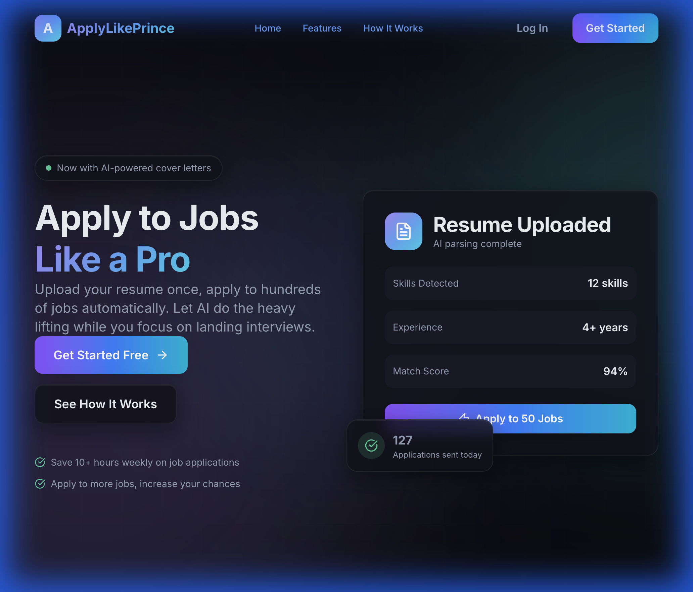

# 🎯 ApplyLikePrince

[](https://opensource.org/licenses/MIT)
[](https://reactjs.org/)
[](https://spring.io/projects/spring-boot)
[](https://openjdk.org/)

> **Upload your resume once, apply to hundreds of jobs automatically.** Let AI do the heavy lifting while you focus on landing interviews.

---

## 📸 Demo 

<div align="center">
  
  
  *Modern Glassmorphism UI with smooth animations*
</div>

### 🎬 UI Demo Video

<div align="center">
  
  
  *Live demo showing navigation, smooth scrolling, and registration flow*
</div>

---

## 📋 Executive Summary

ApplyLikePrince is a production-ready, full-stack job application automation platform that enables users to:

- 📄 **Upload their resume** in PDF/DOCX format
- 🤖 **AI-powered parsing** extracts all relevant information automatically
- 🚀 **Auto-apply** to multiple job portals (LinkedIn, Hirect, Cutshort, etc.)
- 📊 **Track all applications** in a beautiful dashboard
- ✨ **Generate AI cover letters** tailored to each job

---

## 🚀 Quick Start

### Prerequisites

| Requirement | Version | Check Command |
|-------------|---------|---------------|
| Node.js | 18+ | `node --version` |
| npm | 9+ | `npm --version` |
| Java | 17+ | `java --version` |
| Maven | 3.8+ | `mvn --version` |
| PostgreSQL | 15+ | `psql --version` |

### Step 1: Clone the Repository

```bash
git clone https://github.com/iprincekumark/applylikeprince.git
cd applylikeprince
```

### Step 2: Configure Environment

```bash
# Copy the environment template
cp .env.example .env

# Edit with your values
nano .env
```

Required environment variables:

```bash
# Database Configuration
DATABASE_URL=jdbc:postgresql://localhost:5432/applylikeprince
DATABASE_USERNAME=your_db_username
DATABASE_PASSWORD=your_db_password
DATABASE_DRIVER=org.postgresql.Driver
HIBERNATE_DIALECT=org.hibernate.dialect.PostgreSQLDialect

# JWT Configuration (IMPORTANT: Generate a strong 256-bit base64-encoded key)
JWT_SECRET=your-base64-encoded-256-bit-secret-key
JWT_EXPIRATION=86400000       # 24 hours in milliseconds
JWT_REFRESH_EXPIRATION=604800000  # 7 days in milliseconds

# OpenAI API Key (Required for AI features)
OPENAI_API_KEY=sk-your-openai-api-key

# Server Configuration
SERVER_PORT=8080

# CORS Configuration
CORS_ALLOWED_ORIGINS=http://localhost:5173,http://localhost:3000

# File Upload Configuration
UPLOAD_DIR=./uploads
MAX_FILE_SIZE=10MB
MAX_REQUEST_SIZE=10MB

# H2 Console (Development only - disable in production)
H2_CONSOLE_ENABLED=false
```

> **⚠️ Security Note:** Never commit your `.env` file or expose API keys in source code. All sensitive values are loaded from environment variables.

---

## 🤖 AI Features

ApplyLikePrince uses **Spring AI** with **OpenAI GPT-4o-mini** to provide intelligent resume and job application assistance.

### AI Capabilities

| Feature | Description |
|---------|-------------|
| **Resume Parsing** | Automatically extracts name, email, phone, skills, experience, and education from uploaded resumes |
| **Cover Letter Generation** | Creates personalized, ATS-optimized cover letters tailored to specific job descriptions |
| **Resume Optimization** | Analyzes resumes against job descriptions and suggests improvements for better ATS scores |
| **Skill Gap Analysis** | Identifies missing skills and provides learning suggestions |

### How AI Features Work

1. **Resume Upload Flow:**
   - User uploads a PDF or DOCX resume
   - Text is extracted using Apache PDFBox (PDF) or Apache POI (DOCX)
   - Extracted text is sent to OpenAI for intelligent parsing
   - Parsed fields are stored in the database for quick access

2. **Cover Letter Generation:**
   - User provides job title, company name, and optional job description
   - AI generates a professional, personalized cover letter
   - Letter is optimized for ATS with relevant keywords

3. **Resume Optimization:**
   - User submits resume content along with target job description
   - AI analyzes and provides:
     - Missing ATS keywords
     - Content improvement suggestions
     - Achievement quantification recommendations
     - Experience relevancy optimization

### Configuration

The AI is configured via `application.yml`:

```yaml
spring:
  ai:
    openai:
      api-key: ${OPENAI_API_KEY:}  # Set via environment variable
      chat:
        options:
          model: gpt-4o-mini       # Cost-effective, high-quality model
          temperature: 0.7         # Balanced creativity/consistency
```

### Usage Examples

**Parse Resume (via API):**
```bash
curl -X POST http://localhost:8080/api/resumes/upload \
  -H "Authorization: Bearer YOUR_JWT_TOKEN" \
  -F "file=@/path/to/resume.pdf"
```

**Generate Cover Letter:**
```bash
curl -X POST http://localhost:8080/api/applications/cover-letter \
  -H "Authorization: Bearer YOUR_JWT_TOKEN" \
  -H "Content-Type: application/json" \
  -d '{
    "resumeId": 1,
    "jobTitle": "Senior Software Engineer",
    "company": "Google",
    "jobDescription": "..."
  }'
```

### Cost Estimation

| Operation | Estimated Tokens | Approx. Cost |
|-----------|-----------------|--------------|
| Resume Parse | ~2,000 tokens | ~$0.003 |
| Cover Letter | ~1,500 tokens | ~$0.002 |
| Resume Optimization | ~3,000 tokens | ~$0.005 |

*Prices based on GPT-4o-mini rates (~$0.15/1M input, ~$0.6/1M output tokens)*


---

## 🔧 Running the Application

### Option A: Run Backend & Frontend Separately (Development)

#### Terminal 1: Start the Backend

```bash
# Navigate to backend directory
cd backend

# Run with Maven (development mode)
./mvnw spring-boot:run

# OR build and run JAR
./mvnw package -DskipTests
java -jar target/applylikeprince-0.0.1-SNAPSHOT.jar
```

✅ Backend will start at: **http://localhost:8080**

#### Terminal 2: Start the Frontend

```bash
# Navigate to frontend directory
cd frontend

# Install dependencies (first time only)
npm install

# Start development server with hot reload
npm run dev
```

✅ Frontend will start at: **http://localhost:5173**

---

### Option B: Docker (Production-Ready)

```bash
# Start all services (PostgreSQL, Backend, Frontend)
docker-compose up -d

# View logs
docker-compose logs -f

# Stop all services
docker-compose down
```

✅ Access at: **http://localhost** (port 80)

---

## 🧪 Verify Installation

1. Open your browser to **http://localhost:5173**
2. You should see the landing page with:
   - Glassmorphism design with animated gradient orbs
   - Working navigation (Home, Features, How It Works)
   - "Get Started" button leading to registration
3. Test the API at **http://localhost:8080/api/platforms**

---

## ✨ Features

### User Features
| Feature | Status | Description |
|---------|--------|-------------|
| User Registration | ✅ | JWT authentication with refresh tokens |
| Resume Upload | ✅ | PDF/DOCX with AI-powered parsing |
| Auto-Apply | ✅ | Apply to 50+ job platforms |
| Dashboard | ✅ | Real-time application tracking |
| Profile Management | ✅ | Edit skills, experience, social links |
| AI Cover Letters | ✅ | OpenAI-powered personalized letters |

### Technical Features
| Feature | Status | Description |
|---------|--------|-------------|
| JWT Auth | ✅ | Access + refresh token flow |
| Glassmorphism UI | ✅ | Modern frosted glass design |
| Responsive | ✅ | Mobile-first, works on all devices |
| Dark Mode | ✅ | Default dark theme with gradients |
| Smooth Animations | ✅ | Framer Motion page transitions |

---

## 🛠️ Tech Stack

### Frontend
| Technology | Version | Purpose |
|------------|---------|---------|
| React | 18.3 | UI Library |
| Vite | 7 | Build Tool |
| Tailwind CSS | 4 | Styling |
| Framer Motion | 11 | Animations |
| Zustand | 5 | State Management |
| React Router | 7 | Routing |
| Axios | 1.7 | HTTP Client |
| Lucide React | - | Icons |

### Backend
| Technology | Version | Purpose |
|------------|---------|---------|
| Spring Boot | 3.2 | Framework |
| Spring Security | 6 | Authentication |
| Spring AI | 0.8 | LLM Integration |
| PostgreSQL | 15 | Database |
| Apache PDFBox | 3.0 | PDF Parsing |
| Selenium | 4.16 | Web Automation |

---

## 📁 Project Structure

```
applylikeprince/
├── frontend/                   # React application
│   ├── src/
│   │   ├── components/
│   │   │   ├── ui/            # Button, Input, Card, Modal, Toast, etc.
│   │   │   └── layout/        # Navbar, Sidebar, Footer, Layouts
│   │   ├── pages/             # LandingPage, Dashboard, Resumes, etc.
│   │   ├── services/          # API layer (auth, resume, application)
│   │   ├── store/             # Zustand stores (auth, ui)
│   │   └── index.css          # Design system & tokens
│   ├── public/
│   │   ├── demo.webp          # UI demo video
│   │   └── landing-screenshot.png
│   └── package.json
│
├── backend/                    # Spring Boot application
│   ├── src/main/java/com/applylikeprince/
│   │   ├── controller/        # REST controllers
│   │   ├── service/           # Business logic
│   │   ├── entity/            # JPA entities
│   │   ├── repository/        # Data access
│   │   ├── dto/               # Data transfer objects
│   │   └── security/          # JWT & auth config
│   └── pom.xml
│
├── .env.example               # Environment template
├── docker-compose.yml         # Docker configuration
└── README.md                  # This file
```

---

## 🔌 API Endpoints

### Authentication
| Method | Endpoint | Description |
|--------|----------|-------------|
| POST | `/api/auth/register` | Register new user |
| POST | `/api/auth/login` | User login → JWT tokens |
| POST | `/api/auth/refresh` | Refresh access token |

### User & Profile
| Method | Endpoint | Description |
|--------|----------|-------------|
| GET | `/api/users/me` | Get current user profile |
| PUT | `/api/users/me` | Update profile |
| PUT | `/api/users/password` | Change password |

### Resumes
| Method | Endpoint | Description |
|--------|----------|-------------|
| POST | `/api/resumes/upload` | Upload resume (PDF/DOCX) |
| GET | `/api/resumes` | Get all user resumes |
| PUT | `/api/resumes/{id}/primary` | Set as primary |
| DELETE | `/api/resumes/{id}` | Delete resume |

### Applications
| Method | Endpoint | Description |
|--------|----------|-------------|
| POST | `/api/applications/apply` | Submit application |
| POST | `/api/applications/bulk-apply` | Bulk apply to platforms |
| GET | `/api/applications` | Get all applications |
| GET | `/api/applications/stats` | Dashboard statistics |

### Platforms
| Method | Endpoint | Description |
|--------|----------|-------------|
| GET | `/api/platforms` | Get all job platforms |

---

## 🔐 Security

| Feature | Implementation |
|---------|---------------|
| Password Hashing | BCrypt (strength 12) |
| JWT Tokens | Short-lived access + long-lived refresh |
| CORS | Configured for `localhost:5173` |
| Input Validation | Bean validation on all DTOs |
| Environment Secrets | `.env` file (never committed) |

---

## 💰 Deployment Options

### Free Tier Recommendations

| Service | Provider | Free Tier |
|---------|----------|-----------|
| Frontend | Vercel | 100GB/month |
| Backend | Railway | $5 credit/month |
| Database | Supabase | 500MB storage |

**Estimated Monthly Cost: $0-5**

---

## 👨‍💻 Founder

<div align="center">
  
  
  ### Prince
  **Software Engineer | Full Stack Developer**
  
  Crafting scalable applications with modern technologies.  
  Passionate about clean code and exceptional user experiences.
  
  [](https://www.linkedin.com/in/iprincekumark/)
</div>

---

## 🤝 Contributing

1. Fork the repository
2. Create a feature branch (`git checkout -b feature/amazing-feature`)
3. Commit your changes (`git commit -m 'Add amazing feature'`)
4. Push to the branch (`git push origin feature/amazing-feature`)
5. Open a Pull Request

---

## 📜 License

This project is licensed under the MIT License - see the [LICENSE](LICENSE) file for details.

---

<p align="center">
  Built with ❤️ by <a href="https://www.linkedin.com/in/iprincekumark/">Prince</a>
  <br><br>
  ⭐ Star this repo if you find it helpful!
</p>